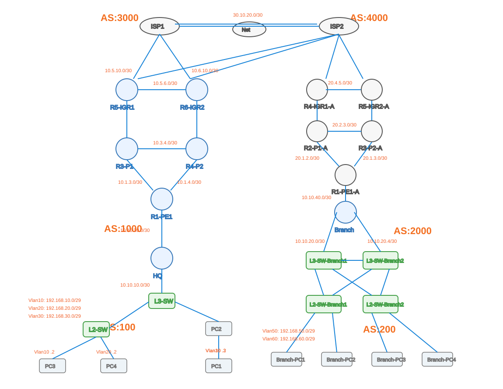

# Multi-AS BGP Lab

## Overview

This repository documents a multi-autonomous-system networking lab built to explore enterprise and service-provider routing behavior, BGP path selection, internal routing protocols, multi-vendor interoperability, and failure convergence.

The lab contains **six autonomous systems** and combines **Juniper SRX/Junos** with **Cisco IOS** platforms.

## Autonomous Systems

| AS | Role | Platform |
|---|---|---|
| AS100 | HQ | Juniper SRX / Junos |
| AS200 | Branch | Juniper SRX / Junos |
| AS1000 | Enterprise transit/core | Juniper SRX / Junos |
| AS2000 | Enterprise transit/core | Cisco IOS |
| AS3000 | ISP1 | Cisco IOS |
| AS4000 | ISP2 | Cisco IOS |

## Routing Design

- HQ (AS100) ↔ AS1000: eBGP
- Branch (AS200) ↔ AS2000: eBGP
- AS1000: IS-IS + iBGP
- AS2000: OSPF + iBGP
- AS1000 ↔ AS3000/AS4000: eBGP
- AS2000 ↔ AS3000/AS4000: eBGP
- AS3000 ↔ AS4000: eBGP
- ISP1 and ISP2 use the upstream lab Internet gateway `10.142.13.1`

## Multi-Vendor Environment

The lab intentionally combines:

- Juniper SRX / Junos in AS100, AS1000, and AS200
- Cisco IOS in AS2000, AS3000, and AS4000

This provides a practical environment for verifying BGP interoperability across different vendors and routing domains.

## Repository Structure

```text
BGP-LAB/
├── README.md
├── PROJECT-REPORT.md
├── configs/
│   ├── as1000/
│   ├── as2000/
│   ├── as3000/
│   └── as4000/
├── docs/
│   ├── architecture.md
│   ├── addressing.md
│   ├── lab-status.md
│   └── routing-design.md
└── testing/
    ├── bgp-verification.md
    └── failover-testing.md
```


## Lab Topology



## Configurations

Published device configurations are sanitized before publication.

Authentication secrets and encrypted Junos password material are not published.

The retired AS1000 R2 references were removed from the published AS1000 configuration copies. The current documented AS1000 topology contains R1, R3, R4, R5, and R6.

## Verification

The captured verification covers:

- BGP session establishment
- eBGP and iBGP relationships
- Route propagation across the six AS domains
- Default-route learning
- Alternate path visibility

## Failure Testing

The current documented evidence includes:

### Test 1 — R5 ↔ ISP1 Link Failure
BGP session failure, alternate route selection, and recovery were verified.

### Test 2 — R6 ↔ ISP1 Link Failure
BGP session failure, alternate route selection, and recovery were verified.

### Test 3 — Full ISP2 Failure
Continuous ICMP from HQ PC2 (`192.168.10.3`) to `8.8.8.8` was used to validate end-to-end failover.

The path changed from:

`ISP2 / AS4000 → ISP1 / AS3000`

During convergence, **42 consecutive ICMP packets were lost** before replies resumed.

The test therefore demonstrates measurable convergence and does not claim hitless or seamless failover.

## Related Projects

This BGP lab evolved from the earlier enterprise HQ, Branch, and HQ-to-Branch IPsec projects. Those projects remain separate repositories.

## Status

The repository currently contains the documented multi-AS configuration set, design documentation, BGP verification, and verified failure-testing results.
